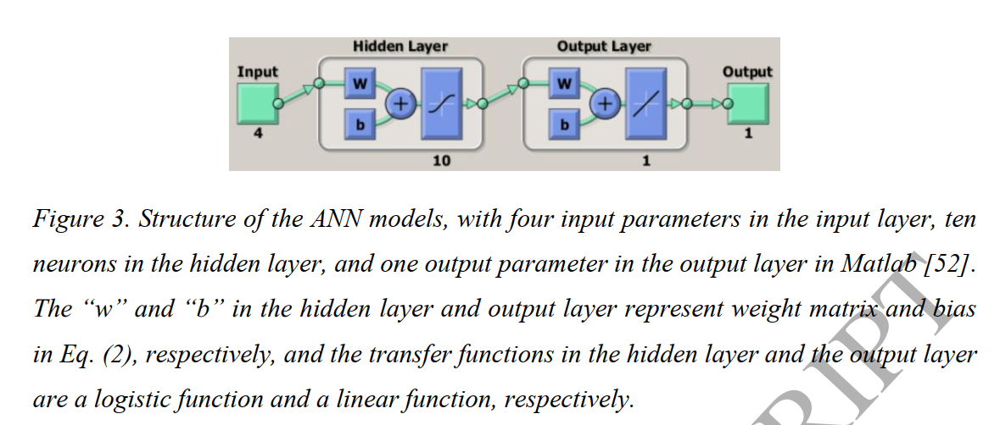

# ANN

## 一、Paper

### Utilizing Artificial Neural Network to Predict Energy Consumption and Thermal Comfort Level: An Indoor Swimming Pool Case Study

> **ANN training process**

input: 9个，`[Hour,Day,Month,Occupancy, RH, Water Temp, Room Temp, Air Temp inlet, Supplied flow rate]`

Output：3个，`[Electricity Consumpution, Thermal Energy Consumpution, PMV]`

Hidden Layer: 
- 层数：2层
- number of neurons for hidden layers = [7,10]

Transfer Function for hidden layer and output layer:[tangent sigmoid, tangetn digmoid, logarithmic sigmoid]

maximum number of epoch:100

error rate：0.001

learning rate：0.01

momentum coefficient：0.8

Performance： Mean Square Error (MSE), Average Absolute Difference
(AAD), Training Error Rate (TER)

### Using an ensemble machine learning methodology-Bagging to predict occupants’ thermal comfort in buildings

> **ANN parameters**

- Input Layers: 13 nodes 
- Hidden Layers: 15 nodes in the second layer
- Output layer: 1 node
- Transfer function: 
  - identity function (for the output layer);
  - Continuous log-sigmoid function (for hidden layers).
- Cost function: mean squared error loss cost function
- Momentum: 0.4; 
- Learning rate: 0.01;
- Number of iteration: 1000

> **Result**

TS Result

PMV Result

SET Result

ET Result

### Development of artificial neural network models for predicting thermal comfort evaluation in urban parks in summer and winter

ANN Structure

### Artificial Neural Network Models Using Thermal Sensations and Occupants’ Behavior for Predicting Thermal Comfort

- Input Layers: `[air temp, rh, clo, meta]`

$ts = f(air temp, rh, clo, meta)$

$behaviour = g(air temp, rh, clo, meta)$

> **舒适区域**

- 利用ANN模型预测输出TS，如果 $-1<TS<1$那么此时的温度区间就是舒适区间

$comfort zone = {(air temp, rh) | ts_l <= f <= ts_u}$

- 利用ANN模型预测输出人员行为，如果低温调节行为为-1， 无动作：0 高温调节行为：1，然后利用人员相应行为占比，来确定舒适区域

$comfort zone = {(air temp, rh) | g >= Acceptability}$
