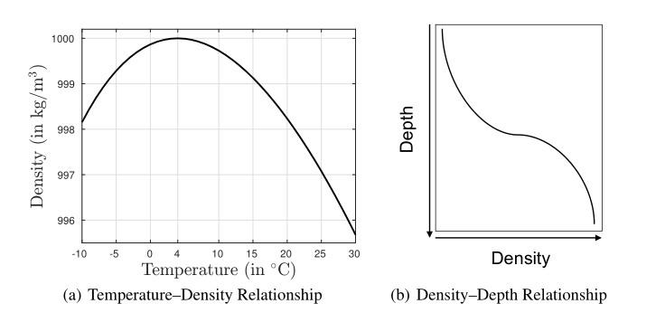

# 数据机理双驱动的方法

## 一、数据机理双驱动建模方法

### 1.1 用模型驱动去指导数据驱动

核心思想：

- 在模型的指导下，进行有方向性的训练，通过模型确定数据下降的方向。构建一个贝叶斯的MVP模型，知道从哪个方向上升

- 在模型启发下，指导网络数据合理的梯度下降方向，对网络参数进行训练

### 1.2 用数据驱动优化或者拟合模型驱动

核心思想：从网络结构本身层次的改变上，它的出发点是改建网络结构，要跟模型有对应关系。**构建网络结构，与模型求解算法一致**

优点：

- 一方面知道网络该怎么构造，
- 另一方面把优化模型里面参数嵌入到网络里面进行端到端的学习

> **例子**

- 建立变换器的机理模型
  - 确定机理模型
  - 不确定机理模型：引入修正系数
  
- 利用数据驱动，通过ANN确定转换器机理模型

- 数据-机理双驱动，确定修正系数的最优值
  - 通过机理模型可以确定修正系数的范围
  - 使用MSE作为评价指标，通过ANN确定最优值（选取最小MSE对应的修正系数）
  

### 1.3 用强大的参数化网络去倒推真实的机理

通过对参数化网络进行数据学习，获得共性推断模型

## 二、热舒适物理模型

人体储热量`S`

$S = M - E + R + C - W$

- S：人体加热或冷却速度
- M：人体代谢率
- E：蒸发热损失
- R：辐射热获取（+）或损失（-）
- C：对流热量获取（+）或损失（-）
- W：人体做功

Gagge俩节点模型中对人体储热的描述：

$S = M[1-0.0023(44-\phi_a*P_a)]-2.2h_c(0.06+0.94w_{rsw})*(P_{sk}-\phi_a * P_a)F_{pcl}-(h_r + h_c)(T_{sk}-T_a)F_{cl}$

- M：为代谢率
- $\phi_a$：相对湿度，小数
- $P_a$：空气温度$T_a$下的饱和蒸汽压
- $T_a$: 空气温度
- $h_c$：对流换热系数，单位$W/m^2℃$
- $w_{rsw}$：皮肤湿润度
- $P_sk$：皮肤温度$T_{sk}$下的饱和蒸汽压
- $F_{pcl}$：服装渗透因子，单位$W/m^2℃$
- $F_{cl}$：服装热效率因子

人体散热速率与热舒适的映射：

$PMV = [0.303*e^{-0.036* M} + 0.028]*S$

上述公式中参数可以分为三类：

- 环境参数：空气温度、风速、相对湿度、蒸汽压
- 可计算的个人参数：皮肤湿润度$w_{rsw}$、服装热效率因子$F_{cl}$、渗透效率因子$F_{pcl}$、对流换热系数$h_c$、辐射换热系数$h_r$
- 不可计算的个人参数，包括皮肤温度$T_{sk}$、代谢率 M。

环境参数可以由环境传感器测量

可计算的个人参数:皮肤湿润度$w_{rsw}$、服装热效率因子$F_{cl}$、渗透效率因子$F_{pcl}$、对流换热系数$h_c$、辐射换热系数$h_r$,  可以**由环境参数和不可计算的个人参数**推导

$F_{cl} = 1/(1 + (h_r + h_c)I_{cl})$

$F_{pcl} = 1/(1 + 0.923h_cI_{cl})$

$h_c = max(2.38|T_{cl} - T_a|^{0.25},12.1\sqrt{V_a})$

$h_r = 4\epsilon *\sigma(A_r/A_D)[(T_{cl} + T_r)/2]^3$，坐立状态下$A_r/A_d = 0.7$

$T_{cl} = 35.7 - 0.028M - I_{cl}F_{cl}{3.96 * 10^{-8}[(T_{cl} + 273)^4] + h_c(T_{cl}-T_a)}$

$w_{rsw} = (P_d-P_a)/(P_{sk} - P_a)$

$T_d = T_a(1-R_w(T_a + 273.15)ln(\phi_a)/L)^{-1}$

$log_{10}P = 8.07131 - 1730.63/(233.426 + T)$

- $I_{cl}$：为服装隔热，单位$m^2℃/W$
- $T_{cl}$: 服装表面温度，单位℃
- $V_a$: 空气流速，单位m/s
- $A_d$: Dubios体表面积
- $A_r$: 人体有效辐射面积，坐立状态下
- $T_r$：平均辐射温度，单位为摄氏度
- $\sigma$：斯特凡-玻尔兹曼常数,Stefan–Boltzmann constant
- $\epsilon$：人体辐射率，可合理假设为0.95
- $P_d$:露点温度$T_d$下的饱和蒸气压
- $R_w$：水蒸汽的气体常数
- $L$：为蒸发焓，在低层大气压中认为为常数
- 特定温度下的饱和蒸汽压可以根据蒸汽压与温度的半经验相关性推导出来，因此参数$P_{sk}$、$P_a$和$P_d$可以由温度$T_{sk}$,$T_a$和$T_d$

## 三、PGNN

> **Physical konwledge**

物理知识分类：

- (a)作为规定物理变量之间关系的基于物理的规则或方程
- (b)以复杂物理系统的数值模型的形式，例如在计算化学、流体动力学、气候科学和粒子物理学中大量使用的动力系统模拟。

优缺点：

- 虽然这些模型极大地促进了我们对物理宇宙的理解，
- 但它们直接从数据中提取知识的能力有限，而且大多只依赖于现有的物理。例如，许多基于物理的模型使用参数化的近似形式来表示复杂的物理过程，这些过程要么不能完全理解，要么不能使用计算可处理的方法来解决。

> **PGNN**

- 首先，我们提出了一种方法来创建基于物理的模型和神经网络架构的混合组合，以充分利用物理和数据。
- 其次，我们提出了一个新的框架，用于使用物理方程中包含的知识来训练神经网络架构，以**确保学习物理一致的解决方案**。

### 3.1 Physics-guided Neural Networks

- 创建基于物理的模型和神经网络的混合组合，称为混合物理数据(HPD)模型
- 在神经网络的学习目标中使用科学知识作为基于物理的损失函数

> **构建混合物理数据模型: Constructing Hybrid-Physics-Data Models**

> **使用物理损失函数**

$arg min_f Loss(\hat{Y}, Y) + \lambda R(f)$

- 其中R(.)测量模型的复杂性，
- λ是权衡超参数

让我们使用如下公式表示 **目标变量 Y** 和 **其他物理变量 Z** 之间的关系。

$G(Y, Z) = 0$

$H(Y, Z) <= 0$

注意：

- G和H是基于物理的方程的一般形式，可以涉及Y和Z的代数操作(例如，在运动学定律中)，或它们的偏微分
- 这些**基于物理的方程必须满足与其他损失函数项相同的标准**(即连续和可微)。

衡量预测模型是否违反上述物理方程的方法之一是使用以下基于物理的损失函数:

$Loss.PHY(\hat{Y}) = ||G(\hat{Y},Z)||^2 + ReLU(\Eta(\hat{Y},Z))$

- 其中`ReLU(.)`表示校正后的线性单位函数。
- `Loss.PHY`不需要对目标变量`Y`进行实际观测，与传统损失函数相比，它甚至可以在未标记的数据实例上进行评估。

PGNN损失函数可以表示为

$arg min_f Loss(\hat{Y},Y) + \lambda R(f) + \lambda_{PHY}Loss.PHY(\hat{Y})$

- 第一项：Empirical Error
- 第二项： Structural Error
- 第三项：物理不一致性
- $\lambda_{PHY}$:超参数，决定了与经验损失和模型复杂性相比，最小化物理不一致性的相对重要性
- 由于假设已知的物理定律对任何不可见的数据实例都同样适用，因此确保模型输出的物理一致性作为PGNN的学习目标，即使在训练数据很小且不完全具有代表性的情况下，也有助于实现更好的泛化性能

### 3.2 PGNN for Lake Temperature Modeling

> **模型介绍**

输入：$X = [D, Y_{PHY}]$ D为原始特征，$Y_{PHY}$为利用物理模型计算所得输出

模型结构：L层隐藏层

$z_1 = W^T_1 x + b_1$
$z_i = W^T_i a_{i - 1} + b_i i = 2_L$
$a_i = f(z_i) i = 1 to L$
$\hat{y} = w^T_{L+1} + b_{L + 1}$

- 其中 $(W,b) = {(W_i, b_i)}^{L + 1}_1$ 表示所有隐藏层和输出层的权重和偏置参数集
- f是隐藏层使用的激活函数

损失函数：
- Empirical Error：均方误差
- Structural Error: $\lambda R(W) = \lambda_1 ||W||_1 + \lambda_2 ||W||_2$

> **Temperature–Density Relationship**

水的温度`Y`和密度`ρ`彼此非线性相关

$ρ = 1000 × (1 − \frac{((Y + 288.9414) × (Y − 3.9863))^2}{ 508929.2 × (Y + 68.12963)}$

如下图所示为温度-密度关系图，与深度-密度关系图

因为在深度 depth 与 时间 t可以对温度 `Y`进行预测，即

$\hat{Y}[d,t]$

因此我们可以得到密度`ρ`与深度 `depth` 与 时间 `t`之间的关系$\hat{ρ}[d,t]$

> **密度-深度关系**

密度-深度关系：如图所示，水的密度随深度单调增加。在同一时间步长t上，两个不同深度`d1`和`d2`处的水密度通过以下方式相互关联：

$ρ[d1,t]−ρ[d2,t]≤0 if d1 < d2 $

为了确保这一基于物理的方程在基于物理的模型的温度预测中得到支持，我们可以如下构建基于物理的损失函数。

为了确保这一基于物理的方程在基于物理的模型的温度预测中得到支持，我们可以如下构建基于物理的损失函数。

让我们考虑在$n_d$个深度值和$n_t$个时间步长的规则网格上输入特征的未标记数据集。在任何一对连续深度值$d_i$和$d_{i+1}$（$d_i<d_{i+1}$）上，我们可以计算时间步长$t$上模型密度估计值的差值，$∆[i，t]=\hat{ρ}[di，t]−\hat{ρ}[d_{i+1}，t]$

$∆[i，t]$的正值可以被视为违反了密度-深度关系。这可以被评估为$ReLU（∆[di，t]）$的非零出现。因此，我们可以将**每个连续深度对和时间步长上所有物理违规的平均值**视为基于物理的损失函数：

$PHY.Loss(\hat{Y}) = \frac{1}{n_t(n_d - 1)} \sum^{n_t}_{t = 1}\sum^{n_d - 1}_{i = 1} ReLU(∆[i，t])$

通过上述推导我们获得了完整的PGNN公式。

注意，在我们特定的湖泊温度建模问题中，尽管神经网络正在训练以提高其预测水温的准确性，但基于物理的损失函数的使用确保了温度预测也转化为其他物理变量之间的一致关系，即密度和深度，从而导致物理问题的健康解决方案

超参数$\lambda_{PHY}$对物理不一致性的影响与RMSE的影响

### 3.3 关于替代HPD模型设计的讨论

我们讨论了基于残差建模技术（见图9）的两种替代HPD模型设计的相关性，科学文献中通常使用残差建模技术来使用数据驱动方法校正基于物理的模型的残差。

- 第一个模型称为`Residual Model` 残差模型，使用简单的ML模型$f_{Res}$作为附加校正项来固定物理模型$Y_{PHY}$的残差。具体而言，我们采用残差建模策略来预测$Y_{Res} = Y - Y_{PHY}$, 而不是建立ML模型直接从输入D预测目标变量Y，而是将$Y_{Res}$添加到$Y_{PHY}$时，可以提供目标变量的校正估计。建立残差模型的主要动机是解决更简单的问题，即估计基于物理模型的残差，该残差表示基于物理模型的系统偏差或等效的未捕获可变性，而不是估计从D到Y的完整函数映射。目标变量Y的最终预测通过简单地将预测残差YRes与物理模型$Y_{PHY}$的输出相加而获得。换句话说，残差模型可以被认为是一个校正单元，其目的是校正基于物理的模型的预测。
- 第二个残差建模的思想与图2所示的基本HPD模型的思想相结合。在这个被称为“混合物理数据残差（HPD-Res）模型”。ML模型使用特征D以及基于物理模型的输出$Y_{PHY}$作为输入，来预测基于物理模型的残差YRes。然后将预测残差添加到YPHY以获得目标变量Y的最终预测。

**模型异同：**

- `HPD-Res`与基本残差（`Res`）模型有一些相似之处，因为它们都预测基于物理的模型的残差，而不是直接预测目标变量。
- `HPD-Res`的不同之处在于，它使用$Y_{PHY}$作为ML架构中的附加输入，这简化了学习残差的任务（注意，在某些情况下，通过一起观察D和YP HY，可能更容易识别基于物理的模型中的系统偏差模式）。
- `HPD-Res`也与基本HPD模型相似，因为它们都使用D和YP HY作为ML模型中的输入。然而，不同之处在于，HPD Res仅预测要添加到YP HY的剩余YRes，以导出目标变量Y的最终预测。

## 四、实验结果

### 3.1 模型结构

input：data = [env,data]
第一层：cal_M(2层) [body]  cal_Tsk(2层) [env,body]
第二层：S(2层) 输入：[body,env,M,Tsk,Psk,Pa]
PMV: 5(5层)，输入:[body, M, Tsk, Psk, environment, Pa, S]
输出层：softmax
dropout: 0.5
learning rate 0.008

| 数据集      | epoch | batch- size | ce-loss | val-ce-loss | end   | 精度    |
|----------|-------|-------------|---------|-------------|-------|-------|
| 实验数据 * 2 | 75    | 16          | 0.8225  | 0.7634      | 64/75 | 0.625 |
| 生成数据 * 2 | 75    | 16          | 0.3181  | 0.1447      | 68/75 | 0.937 |
| 实验 + 生成  | 75    | 16          | 0.6917  | 0.5782      | 37/75 | 0.78  |

| 数据集      | epoch | batch- size | ce-loss | val-ce-loss | end    | 精度    |
|----------|-------|-------------|---------|-------------|--------|-------|
| 实验数据 * 2 | 128   | 32          |         |             |        |       |
| 生成数据 * 2 | 128   | 32          | 0.2925  | 0.1171      | 36/128 | 0.961 |
| 实验 + 生成  | 128   | 32          | 0.6584  | 0.5724      | 66/128 | 0.79  |